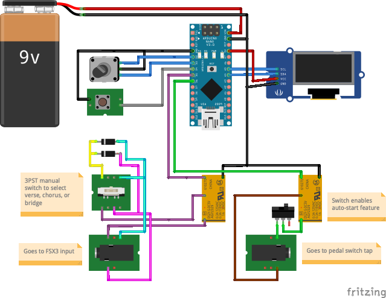

# Drumatic Affect

The circuit and program described in this project are used to add features to the 
[Digitech SDRUM](https://www.digitech.com/band-creator/SDRUM.html)
pedal, which is a drum machine that has a lot of cool features but seems to be missing some
key functionality for my purposes. The main thing that it is missing is a way to specify
a specific beats per minute. The use cases for the design of the pedal seem to be to use tap
tempo to set the tempo, or to set the tempo when a song is programmed.

I intend to use the pedal to drive the tempo of the song, but I don't program the song slots
with specific songs. Each song slot merely has various beats programmed that can be used in 
various songs. I simply select the set of verse / chorus / bridge beats that work the best for
a song, then set the proper tempo for the song, and start it. I want to be able to set a 
specific tempo that I've determined ahead of time so that the SDRUM unit can keep that exact
tempo rather than setting one on-the-fly with the tap tempo.

Unfortunately, this is the one thing that the SDRUM unit can't do. There is no way to know or set
the exact tempo. You can get in-the-ballpark by using a metronome to set a tempo then trying to
tap that tempo, but it's somewhat in-exact.

The idea came about to have a hardware device send the tap signal rather than a person. This woould
give a very exact tempo that could be set simply be dialing in the correct tempo on the device
and having it send emulated taps to the footswitch input. That device is the **Drumatic Affect**.

# Schematic

The schematic for the Drumatic Affect device is shown below.

This circuit includes two relays driven by an Arduino Uno and the code in this repository.
The first relay is used to send the tap signal to the FSX3 footswitch input. A 3PST switch can
be used to select which song part to select. This requires the pedal to be in **Direct Part**
mode which allows you to select the verse, chorus, and bridge directly using each of the three
buttons on the FSX3 switch. You can also select the chorus pole of the switch and run the 
pedal in the **Table Top** mode.

The second relay is trickier to use because it requires modifying the pedal (and voiding the
warranty). It is connected to the footswitch on the pedal itself. This requires you to open
the pedal and add leads to the two solder points on the footswitch sub-board and run those
leads to the second relay in this circuit. This relay is used to auto-start a song as soon
as the tempo is set, so it is optional if you can start the song manually after setting the
tempo.

The rest of the circuit is fairly straightforward. There is a rotary encoder with a push button 
switch (shown as two separate components in this diagram). The rotary encoder is used to select
the tempo, then pushing the switch sends three "taps" to the FSX3 input to select the song
part and set the tempo. The second relay then sends a signal to the pedal to start the song.
